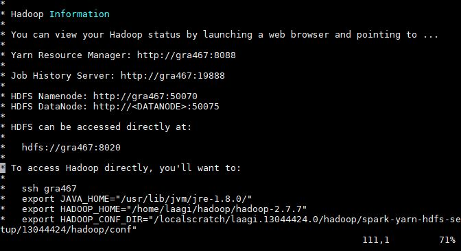
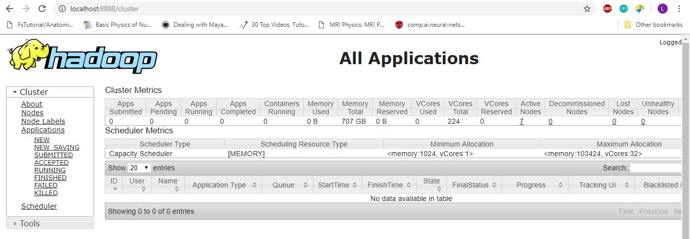

## Spark with YARN on Compute Canada clusters using Magpie

### Magpie:

https://github.com/LLNL/magpie
Created by Albert Chu at LLNL.

## Setup

Download [Hadoop](https://hadoop.apache.org/releases.html)(tested on 2.7.7), [Spark](https://spark.apache.org/downloads.html) (tested on 2.4.0), and [Magpie](https://github.com/LLNL/magpie). Unzip to a directory on /home/$USER/ (or projects or scratch, somewhere accessible from all nodes). You will have to set these paths in the submission script you use for magpie home, spark home, hadoop home.

## spark-with-yarn-hdfs.sl

The script spark-with-yarn-hdfs.sl is just a modified version of /submission-scripts/script-sbatch-srun/magpie.sbatch.srun-spark-with-yarn-and-hdfs from magpie, to work with compute canada. We use $SLURM_TMPDIR for local directory. To find out the python path for your required version, do 

```
module load python/3.7.0
which python
#/cvmfs/soft.computecanada.ca/easybuild/software/2017/Core/python/3.7.0/bin/python
```

Also modified the enviornmental extras for hadoop and spark to make sure each node has the proper python enviornment. This is in the python_start script. You just use sbatch to submit the spark-with-yarn-hdfs.sl script and it should start up your cluster.

Once your job is setup, read the job output file and it will tell you how to connect to the master node and set the required enviornmental variables:




## Pyspark

You will want to setup python enviornment on all nodes. You can set this option in the submission script by adding a script for extra enviornmental variables for spark and hadoop.

If your script requires any files make sure to put it into hdfs:

```
$HADOOP_HOME/bin/hdfs dfs –put path/to/T1lookup /user/laagi/T1_Lookup
```
To start an interactiv shell:

```
$SPARK_HOME/bin/pyspark
```

To submit a job:

```
$SPARK_HOME/bin/spark-submit --master yarn --deploy-mode cluster piecewise.py
```

You can also try client for deply mode which seems to be more verbose, and more useful for debugging. The webpages are also useful.

## SSH tunneling to access web UI

https://docs.computecanada.ca/wiki/SSH_tunnelling

I use MobaXterm. SSH into master, than open another local terminal. In that terminal type something like

```
ssh –L 8888:gra467:8088 username@graham.computecanada.ca
```

Now open a browser on your local computer and type localhost:8888 and it should bring up the resource manager. When you click on a spark submitted application, the URL will change to gra467:8088/proxy/application_1554012802661_0002/. You want to change that back to localhost:8888/proxy/application_1554012802661_0002.


